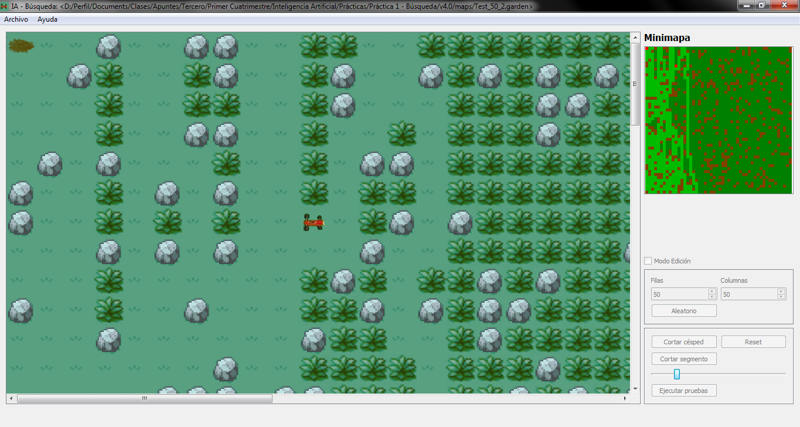
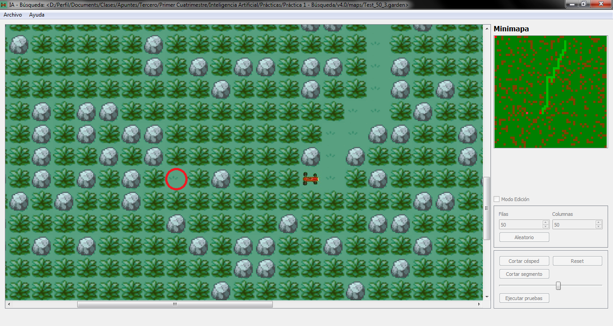

Lawnmover
========

Robot lawnmover simulator
* version: 1.0
* Project for the subject "Inteligencia Artificial", Universidad de La Laguna.
* Date: 28/10/2013

## Screenshots

## [Colaborators](https://github.com/alu0100694765/LawnmoverIA/graphs/contributors)
Sawan Jagdish Kapai Harpalani. Contact: <alu0100694765@ull.edu.es>

## Project Description
> This project simulates a robotic lawnmover that using diferent Artificial Intelligence algorithms cuts the grass.

## Programming language.
Qt is used mainly for developing application software with graphical user interfaces (GUIs); however, programs without a GUI can be developed, such as command-line tools and consoles for servers. An example of a non-GUI program using Qt is the Cutelyst web framework.[15] GUI programs created with Qt can have a native-looking interface, in which cases Qt is classified as a widget toolkit.

Qt uses standard C++ with extensions including signals and slots that simplifies handling of events, and this helps in development of both GUI and server applications which receive their own set of event information and should process them accordingly. Qt supports many compilers, including the GCC C++ compiler and the Visual Studio suite. Qt also provides Qt Quick, that includes a declarative scripting language called QML that allows using JavaScript to provide the logic. With Qt Quick, rapid application development for mobile devices became possible, although logic can be written with native code as well to achieve the best possible performance. Qt can be used in several other programming languages via language bindings. It runs on the major desktop platforms and some of the mobile platforms. It has extensive internationalization support. Non-GUI features include SQL database access, XML parsing, JSON parsing, thread management and network support.